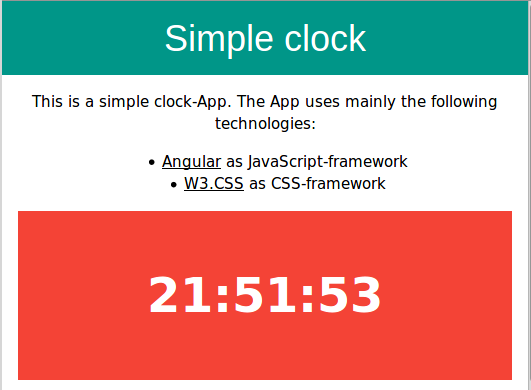

# Simple clock app

At the moment I work with [Angular](https://angular.io/). During this work I created this little clock app.  
In addition I used the [W3.CSS](https://www.w3schools.com/w3css/default.asp) as CSS framework.  
The app is not spectacular. 

---

## Usage  

You simply open the file ```index.html``` in a web browser of your choice.  

---

## How it looks like  


